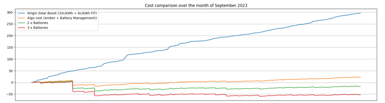
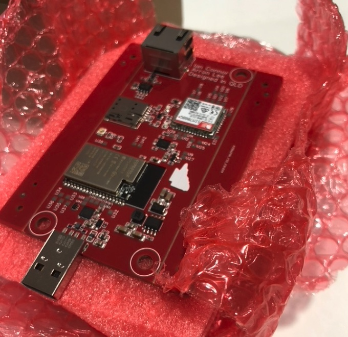

**Site-Specific Performance Estimate and Installation Design**

**Client:** [Client's Name] \
**Property Address:** [Property Address] \
**Date:** [Date]

------------
**Company:** Bliss.AI Pty Ltd \
**ABN:** 13608391288 \
**Address:** 32 Kennedy Tce Paddington QLD 4064 \
**Phone:** 0408740869 \
**Email:** support@blissai.com

**Introduction:**

This document outlines the site-specific performance estimate and installation design for the installation of our home energy management system at the above-mentioned property. This estimate and design are based on the specific characteristics of the property and energy consumption patterns.

**1. Property Details:**
- **Property Type:** Single-family residence
- **Roof Type:** Pitched roof
- **Roof Orientation:** South-facing
- **Available Roof Space:** [Square meters or square feet]
- **Existing Solar Panels:** None

**2. Energy Consumption Analysis:**
- **Historical Energy Consumption:** Based on historical energy bills, the property's average monthly energy consumption is approximately [Average kWh].
- **Energy Usage Patterns:** The property's energy usage patterns indicate higher energy consumption during [Specify Times, e.g., evenings].
- **Desired Energy Goals:** The client aims to reduce energy bills and achieve energy independence.

**3. Proposed System Design:**
- **Solar Panels:** A solar panel system with an estimated capacity of [Specify kW] will be installed on the south-facing roof. The system will consist of [Specify Number of Panels] panels.
- **Battery Storage:** A battery storage system with a capacity of [Specify kWh] will be installed to store excess energy generated by the solar panels during the day.
- **Energy Management System:** Our AI-driven energy management system will be integrated to optimize energy usage, monitor energy flows, and provide real-time insights.
- **Grid Connection:** The system will remain connected to the grid for backup power and net metering (if applicable).

**4. Performance Estimate:**
- **Solar Energy Generation:** Based on the property's location and available roof space, the estimated annual solar energy generation is [Specify kWh/year].
- **Energy Savings:** The installation is expected to reduce the client's energy bills by approximately [Specify %] annually.
- **Return on Investment (ROI):** The estimated ROI period for this installation is [Specify Years].

**5. Installation Timeline:**
- **Installation Start Date:** [Specify Date]
- **Estimated Completion Date:** [Specify Date]
- **Inspection and Testing:** A comprehensive inspection and testing of the installed systems will be conducted before project completion.

**6. Additional Considerations:**
- **Warranty:** The solar panels and battery storage system come with [Specify Warranty Period] warranties.
- **Maintenance:** Regular maintenance checks will be recommended to ensure optimal system performance.
- **Compliance:** We are committed to industry standards and adhere to the New Energy Tech Consumer Code (NETCC) for consumer protection and ethical business practices.

**7. Client Approval:**
- The client's approval is required to proceed with the installation. Please review this document and provide your written consent for the project to commence.

**Client's Signature:** ______________________________\
**Date:** ______________________________

**Conclusion:**
This site-specific performance estimate and installation design have been tailored to meet the client's energy goals and property characteristics. The proposed system aims to maximize energy savings, reduce environmental impact, and enhance energy efficiency. Please note that our company is not a solar or battery installer and this is for the energy management hardware and software used for solar and battery management.
